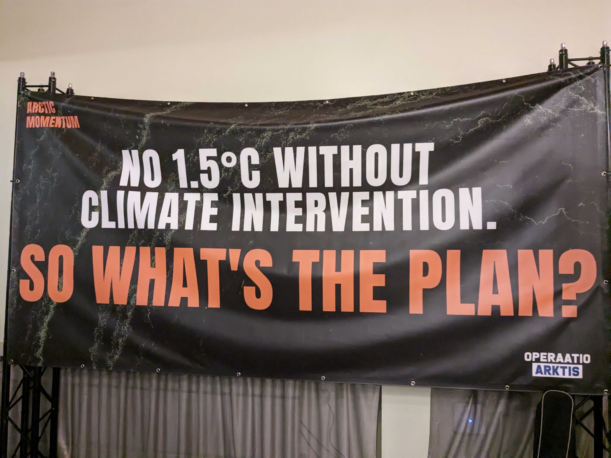

At the end of August 2023 I took part in Arctic Momentum, an event organised by Operaatio Arktis, in Helisinki. Over a two day workshop, climate activists, indigenous Saami representatives, politicians, scientists and other stakeholders met to discuss whether and how direct intervention could be used to slow or reverse Arctic climate change. Topics discussed included local interventions, like pumping sea-water onto sea-ice to thicken it, as well as the more familiar global interventions like SAI and MCB, but with a focus on what happens in the high North under these interventions. I gave a talk on the focus of my PhD - Arctic under SAI - and it was great to see lots of interest in the topic. 

After this workshop, there was a public event on the final evening including talks on the science (one from your's truly) as well as I think the most powerful short call to action on solar geoenigneering I have heard yet, delivered by Anni Pokela representing Operaatio Arktis. I encourage you to watch it [here](https://www.youtube.com/watch?v=0It_xZnLdyo). I left the event feeling frankly terrified by the effect this speech had on me. It was the first time i had heard a full delivery of the simple argument for solar geoengineering from an XR/young climate activist world-view. Broadly, the argument is:
* *We are in a climate emergency, and cannot afford to warm past 1.5C (or perhaps 2C).
* *We will pass this (these) thresholds without solar geoengineering. 
* *Therefore we must do solar geoengineering*
This wasn't precisely the argument Anna gave - Operaatio Arktis, i think, do not yet call directly for intervention - but it wasn't far off. The reason i find this scary is that if you except the two premises, it is unassailable. Many young people I know do strongly support the first premise. In fact, many thousands of young passionate people all around Europe have been protesting with something like the first premise written on placards off and on since Greta started the school strikes. Accepting the second premise is less common, but reality and the progress of time are beginning to force one's hand there. So putting these together, my gut says that we could be on the brink of a rapid change in the disposition towards solar geoengineering amongst the young climate activist world, and Operaatio Arktis might be the first example of a new wave. That's not necessarily a bad thing. Perhaps its long overdue. But it is a *scary* thing, to me at least, as it represents a huge step towards this massive change in our relationship to nature, which i study every day but so far lives only in people's heads, becoming reality.

GIF: sea ice concentration (top) and Arctic temperature (bottom) under a medium emissions scenario (SSP2-4.5) and a scenario using SAI cool the planet (SAI). More sea ice and a colder Arctic under is simulated under this kind of solar geoengineering. 

