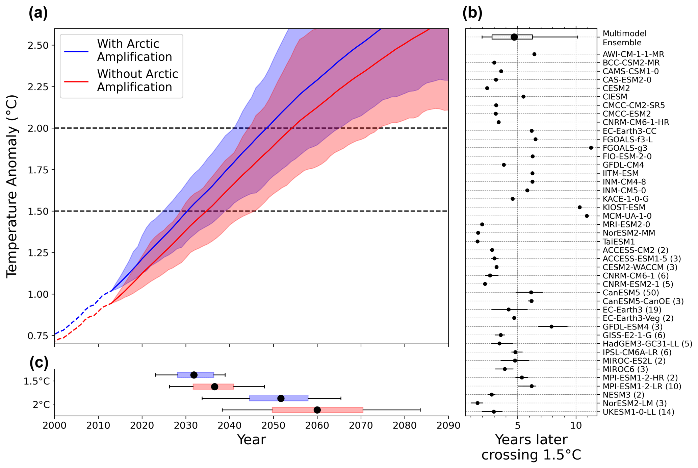

We have a new paper published in Earth System Dynamics! In it we quantify for the first time the size of Arctic amplification in terms of the difference in crossing date for the Paris thresholds. Arctic amplification is the name we give to the phenomenon of faster warming in the Arctic than the rest of the world, under climate change. And often we discuss this in terms of a warming ratio, for example Mika Rantanen et al., [had a paper out last year ](https://www.nature.com/articles/s43247-022-00498-3) showing a 4x warming ratio. However, my co-author Robbie Mallet, whose original idea this work was, had seen first-hand that this framing sometimes lacked cut-through in the climate policy world, where people are used to thinking in terms of the Paris agreements temperature thresholds (2°C, targeting 1.5°C) and the global mean warming. So our paper aimed to address this problem by reframing Arctic amplification in those terms.

We constructed a hypothetical world in which the Arctic warmed at the global mean rate, and diagnosed when such a world crosses the temperature thresholds under several plausible emissions scenarios, using a bias-corrected version of the CMIP6 ensemble of climate models. This refers to the set of 40-odd global climate models, each built often over decades by centres around the world, which all projected climate changes under certain standardised emissions pathways to support the 5th IPCC Assessment report. The set of these different models provides an imperfect handle on future climate and its uncertainty.

By comparing our hypothetical world without Arctic amplification against the projections for our real world, we were able to show that Arctic amplification contributes something like a 5-year difference to the crossing date of the 1.5°C threshold, and an 8-year difference to the 2°C threshold.

